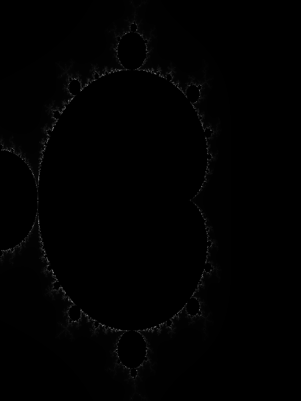

# fractalGen
Generate colorful mandelbrot fractals using modern C++ and advanced programming principles. 

<p align="center">
  
</p>


<br></br>

## Build and Run 
To build and run, type 
```
make run 
``` 
and open bitmap.bmp to view the generated fractal.

