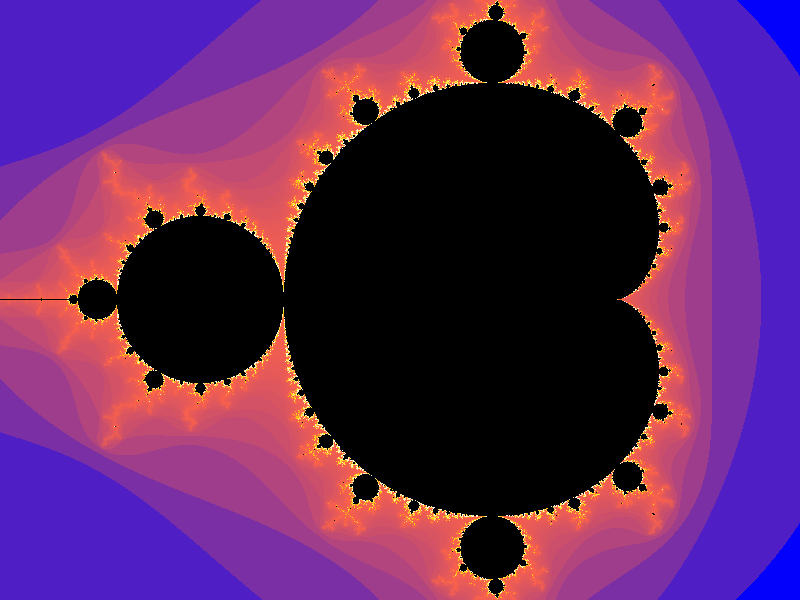
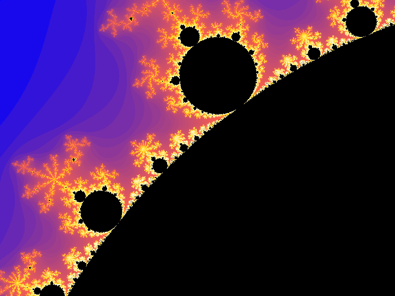

<h1 align="center"> FractalGen
<h4 align="center">Generate colorful Mandelbrot fractals using modern C++ and advanced programming principles.
<br></br>
<br></br>

Original             |  Zoomed
:-------------------------:|:-------------------------:
  |  


<br></br>
### Build and Run 

To build and run:
```
cd 
git clone https://github.com/HakamAtassi/fractalGen
cd fractalGen
make run
```
and open bitmap.bmp to view the generated fractal.

<br></br>


## Algorithms

blah blah blah

### Mapping
blah blah blah

### Coloring
blah blah blah
